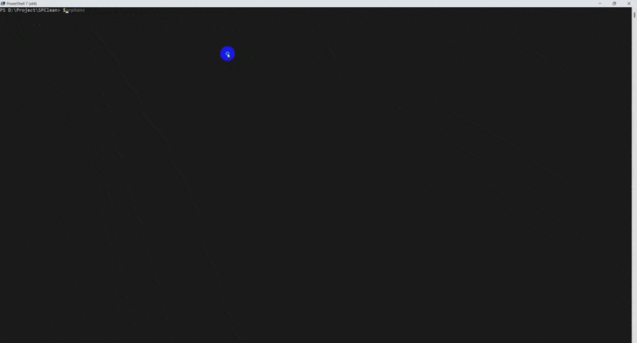

# SPClean

> **PowerShell toolkit for SharePoint Online permission hygiene.**  
> Find orphaned users, score risk, generate reports, and remove safely — without enterprise-software pricing.


---

## Why SPClean

Every SharePoint tenant accumulates **orphaned users** — accounts that linger in site permission lists long after the employee left, the contractor finished, or the guest expired. Microsoft has no built-in tool to find and clean them at scale.

The result: deleted accounts still holding active permissions, compliance reports flagging ghost identities, and hours of manual cleanup per tenant.

SPClean fixes this in minutes:

```powershell
# Scan all sites, get a colour-coded HTML report
Connect-SPCTenant -TenantName contoso -ClientId '<app-id>'
Get-SPCOrphanedUser -AllSites | Export-SPCReport -Format HTML -IncludeSummary

# Preview what would be removed — no changes made
Get-SPCOrphanedUser -AllSites | Remove-SPCOrphanedUser -WhatIf

# Remove HIGH-risk orphans with a snapshot backup
Get-SPCOrphanedUser -AllSites |
    Where-Object RiskLevel -eq 'HIGH' |
    Remove-SPCOrphanedUser -CreateSnapshot -SnapshotPath C:\Snapshots
```

<!-- TODO: Add demo GIF here once recorded -->
<!--  -->

---

## Licensing

SPClean uses a **free + paid tier** model. Core scanning is always free.

| Tier | Price | Features |
| --- | --- | --- |
| **Free** | $0 forever | Unlimited site scan · CSV export · WhatIf dry-run |
| **Pro** | $79 / tenant / year | HTML report · Scheduled scan · Snapshot & restore |
| **Consultant** | $149 / year | Unlimited tenants · Priority support |

**→ [Purchase a license at hungpham2802.gumroad.com](https://hungpham2802.gumroad.com)**

After purchasing, activate with one command:

```powershell
Register-SPCLicense -LicenseKey 'SPCLEAN-PRO-...'
```

---

## Contents

- [Requirements](#requirements)
- [Installation](#installation)
- [Authentication setup](#authentication-setup)
- [Quick start](#quick-start)
- [Cmdlet reference](#cmdlet-reference)
- [Permission requirements](#permission-requirements)
- [Scheduling automated scans](#scheduling-automated-scans)
- [Snapshot and recovery](#snapshot-and-recovery)
- [Troubleshooting](#troubleshooting)
- [Security notes](#security-notes)

---

## Requirements

| Requirement | Minimum version |
| --- | --- |
| PowerShell | 5.1 or 7+ |
| PnP.PowerShell | 2.0.0 (tested on 3.2.0) |
| Microsoft.Graph.Authentication | 2.0.0 (tested on 2.38.0) |
| SharePoint Online role | Site Collection Administrator (single site) or SharePoint Administrator (all sites) |
| Entra ID role | At least User Administrator (read-only scan) |

Install dependencies:

```powershell
Install-Module PnP.PowerShell                 -Scope CurrentUser -Force
Install-Module Microsoft.Graph.Authentication -Scope CurrentUser -Force
```

---

## Installation

```powershell
Install-Module -Name SPClean -Scope CurrentUser
```

Or using PSResourceGet:

```powershell
Install-PSResource -Name SPClean
```

**Install from source:**

```powershell
git clone https://github.com/hungpham2802/SPClean.git
Import-Module .\SPClean\SPClean.psm1 -Force
```

Verify the import:

```powershell
Get-Command -Module SPClean
```

Expected output: `Connect-SPCTenant`, `Disconnect-SPCTenant`, `Get-SPCOrphanedUser`, `Export-SPCReport`, `Remove-SPCOrphanedUser`, `Restore-SPCOrphanedUser`, `New-SPCScanSchedule`, `Register-SPCLicense`, `Get-SPCLicenseInfo`.

---

## Authentication setup

SPClean supports two authentication methods. You must connect before using any other cmdlet.

### Method A — Interactive (delegated, for manual use)

Requires an Entra app registration configured for delegated auth.

**One-time app registration setup:**

1. Go to **Entra Admin Center → App registrations → New registration**
2. **Authentication blade:**
   - Add platform → Mobile and desktop applications
   - Redirect URI: `https://login.microsoftonline.com/common/oauth2/nativeclient`
   - Enable **Allow public client flows = Yes**
3. **API permissions** → Add delegated permissions:
   - Microsoft Graph: `User.Read.All`, `Directory.Read.All`
   - SharePoint: `AllSites.FullControl`
4. **Grant admin consent**

**Connect:**

```powershell
Connect-SPCTenant -TenantName contoso -ClientId '<your-app-client-id>'
```

A browser window opens for sign-in. Use an account with SharePoint Admin or Site Collection Admin rights.

---

### Method B — AppOnly / certificate (for automation and scheduled tasks)

Requires an Entra app registration with a certificate credential.

**One-time app registration setup:**

1. Go to **Entra Admin Center → App registrations → New registration**
2. **Certificates & secrets** → upload a `.pfx` or `.cer` certificate
3. **API permissions** → Add application permissions:
   - Microsoft Graph: `User.Read.All`, `Directory.Read.All`, `Sites.FullControl.All`
   - SharePoint: `Sites.FullControl.All`
4. **Grant admin consent**

**Connect:**

```powershell
$certPwd = Read-Host -AsSecureString 'Certificate password'
Connect-SPCTenant -TenantName contoso `
    -AuthMethod AppOnly `
    -ClientId    '<your-app-client-id>' `
    -CertificatePath C:\certs\spclean.pfx `
    -CertificatePassword $certPwd
```

---

### Method C — AppOnly / client secret

```powershell
$secret = Read-Host -AsSecureString 'Client secret'
Connect-SPCTenant -TenantName contoso `
    -AuthMethod AppOnly `
    -ClientId    '<your-app-client-id>' `
    -ClientSecret $secret
```

---

### Disconnect

```powershell
Disconnect-SPCTenant
```

---

## Quick start

```powershell
# 1. Connect
Connect-SPCTenant -TenantName contoso -ClientId '<app-id>'

# 2. Scan one site and view results
Get-SPCOrphanedUser -SiteUrl 'https://contoso.sharepoint.com/sites/HR'

# 3. Export to HTML report  [Pro]
Get-SPCOrphanedUser -SiteUrl 'https://contoso.sharepoint.com/sites/HR' |
    Export-SPCReport -Format HTML -IncludeSummary

# 4. Preview what would be removed (WhatIf — no changes made)
Get-SPCOrphanedUser -SiteUrl 'https://contoso.sharepoint.com/sites/HR' |
    Remove-SPCOrphanedUser -WhatIf

# 5. Remove HIGH-risk orphans with a snapshot backup  [Pro]
Get-SPCOrphanedUser -SiteUrl 'https://contoso.sharepoint.com/sites/HR' |
    Where-Object RiskLevel -eq 'HIGH' |
    Remove-SPCOrphanedUser -CreateSnapshot -SnapshotPath C:\Snapshots -Confirm

# 6. Disconnect
Disconnect-SPCTenant
```

---

## Cmdlet reference

### `Connect-SPCTenant`

Establishes a session to SharePoint Online and Microsoft Graph for all SPClean cmdlets.

```
Connect-SPCTenant
    -TenantName           <string>               # Required. 'contoso', 'contoso.onmicrosoft.com', etc.
    [-AuthMethod          Interactive|AppOnly]   # Default: Interactive
    [-ClientId            <string>]              # Required for Interactive and AppOnly
    [-CertificatePath     <string>]              # AppOnly: path to .pfx
    [-CertificatePassword <SecureString>]        # AppOnly: .pfx password
    [-ClientSecret        <SecureString>]        # AppOnly: client secret (alternative to certificate)
```

Returns: `SPC.ConnectionInfo`

---

### `Disconnect-SPCTenant`

Clears the module connection state and disconnects PnP and Graph sessions.

```powershell
Disconnect-SPCTenant
```

---

### `Get-SPCOrphanedUser`

Scans one or more site collections and returns orphaned user objects.

```
Get-SPCOrphanedUser
    [-SiteUrl        <string[]>]           # One or more site URLs. Accepts pipeline.
    [-AllSites]                            # Scan all sites in the tenant.
    [-IncludeGuests]                       # Include orphaned external (#EXT#) accounts.
    [-IncludeDisabled]                     # Include Entra-disabled accounts.
    [-ExcludeSiteUrl <string[]>]           # URLs to skip in -AllSites scan. Supports wildcards.
    [-ThrottleLimit  <int>]                # Concurrent site connections. Default 3, max 10.
```

Returns: `SPC.OrphanedUser` objects with properties:

| Property | Description |
| --- | --- |
| `UPN` | User principal name |
| `DisplayName` | Display name from UIL |
| `LoginName` | SharePoint claim (e.g. `i:0#.f\|membership\|user@contoso.com`) |
| `SiteUrl` | Site collection URL |
| `SiteTitle` | Site collection display name |
| `OrphanType` | `Deleted`, `SoftDeleted`, `Disabled`, `GuestOrphaned` |
| `RiskLevel` | `HIGH`, `MEDIUM`, `LOW` |
| `HasDirectPermissions` | Whether user has direct role assignments |
| `GroupMemberships` | SharePoint groups the user belongs to |
| `DetectedAt` | UTC timestamp |

**Risk scoring:**

| Level | Condition |
| --- | --- |
| **HIGH** | Deleted or GuestOrphaned with active permission assignments |
| **MEDIUM** | SoftDeleted (still accessible until purged) or Disabled with direct permissions |
| **LOW** | Deleted with no active permissions — UIL entry only |

**Examples:**

```powershell
# Single site
Get-SPCOrphanedUser -SiteUrl 'https://contoso.sharepoint.com/sites/HR'

# All sites, exclude OneDrive
Get-SPCOrphanedUser -AllSites -ExcludeSiteUrl '*-my.sharepoint.com/*'

# All sites, include guests and disabled accounts
Get-SPCOrphanedUser -AllSites -IncludeGuests -IncludeDisabled
```

---

### `Export-SPCReport` `[Pro]`

Generates a CSV, HTML, or JSON report from orphaned user pipeline input.

> CSV export is **free**. HTML and JSON reports require a **Pro or Consultant** license.

```
Export-SPCReport
    -InputObject  <SPC.OrphanedUser[]>         # Accepts pipeline.
    [-Format      CSV|HTML|JSON]               # Default: CSV
    [-OutputPath  <string>]                    # Default: auto-named file in current directory
    [-GroupBy     Site|RiskLevel|OrphanType]   # Default: Site
    [-IncludeSummary]                          # Prepend summary card (totals, breakdowns)
    [-PassThru]                                # Pass input objects through the pipeline
```

Returns: `SPC.ReportResult`

HTML reports include colour-coded risk badges — **HIGH** (red), **MEDIUM** (amber), **LOW** (green) — and sortable columns.

**Examples:**

```powershell
# HTML report with summary card  [Pro]
Get-SPCOrphanedUser -AllSites |
    Export-SPCReport -Format HTML -IncludeSummary -OutputPath C:\reports\orphans.html

# CSV grouped by risk level (free)
Get-SPCOrphanedUser -SiteUrl $url |
    Export-SPCReport -Format CSV -GroupBy RiskLevel -OutputPath C:\reports\orphans.csv
```

---

### `Remove-SPCOrphanedUser`

Removes orphaned users from SharePoint UILs and revokes direct role assignments.

> Does **not** delete accounts from Entra ID or remove users from SharePoint groups.  
> `-CreateSnapshot` requires a **Pro or Consultant** license.

```
Remove-SPCOrphanedUser
    -InputObject  <SPC.OrphanedUser[]>                              # Accepts pipeline.
    [-RiskLevel   HIGH|MEDIUM|LOW]                                  # Filter by risk level
    [-OrphanType  Deleted|SoftDeleted|Disabled|GuestOrphaned]       # Default: Deleted only
    [-CreateSnapshot]                                               # Save JSON snapshot before removal  [Pro]
    [-SnapshotPath <string>]                                        # Snapshot directory
    [-Force]                                                        # Suppress -Confirm prompts
    [-WhatIf]                                                       # Preview only — no changes made
    [-Confirm]                                                      # Prompt before each removal
```

Returns: `SPC.RemovalResult`

**Examples:**

```powershell
# Preview (no changes)
Get-SPCOrphanedUser -SiteUrl $url | Remove-SPCOrphanedUser -WhatIf

# Remove HIGH-risk deleted users with snapshot backup  [Pro]
Get-SPCOrphanedUser -SiteUrl $url |
    Remove-SPCOrphanedUser -RiskLevel HIGH -CreateSnapshot -SnapshotPath C:\Snapshots
```

---

### `Restore-SPCOrphanedUser` `[Pro]`

Re-applies permissions from a JSON snapshot file created by `Remove-SPCOrphanedUser -CreateSnapshot`.

```
Restore-SPCOrphanedUser
    -SnapshotPath <string>   # Path to the .json snapshot file
    [-WhatIf]
    [-Confirm]
```

Returns: `SPC.RestoreResult`

```powershell
Restore-SPCOrphanedUser -SnapshotPath C:\Snapshots\user@contoso.com_20260622T120000Z.json
```

---

### `New-SPCScanSchedule` `[Pro]`

Generates a self-contained scan script and registers a Windows Scheduled Task. Always uses AppOnly authentication.

```
New-SPCScanSchedule
    -TenantName          <string>
    -ClientId            <string>
    -CertificatePath     <string>
    -CertificatePassword <SecureString>
    [-Schedule           Daily|Weekly|Monthly]
    [-ScheduleAt         <datetime>]
    [-ReportFormat       HTML|CSV|JSON]          # Default: HTML
    [-ReportOutputPath   <string>]
    [-TaskName           <string>]               # Default: SPClean_OrphanedUserScan
    [-WhatIf]
```

Returns: `SPC.ScheduleResult`

```powershell
$certPwd = Read-Host -AsSecureString 'Certificate password'
New-SPCScanSchedule -TenantName contoso `
    -ClientId        '<app-id>' `
    -CertificatePath C:\certs\spclean.pfx `
    -CertificatePassword $certPwd `
    -Schedule        Weekly `
    -ReportOutputPath C:\Reports\SPClean
```

---

### `Register-SPCLicense`

Activates a purchased license key on the current machine.

```
Register-SPCLicense
    -LicenseKey <string>   # The key from your Gumroad purchase email
    [-Force]               # Overwrite existing license without prompting
```

```powershell
Register-SPCLicense -LicenseKey 'SPCLEAN-PRO-...'
```

---

### `Get-SPCLicenseInfo`

Returns the currently registered license status.

```powershell
Get-SPCLicenseInfo
# Tier: PRO | Status: Active | Expires: 2027-06-25 | Email: user@contoso.com
```

---

## Permission requirements

### AppOnly auth (automation / scheduled tasks)

| Permission | Type | API | Purpose |
| --- | --- | --- | --- |
| `Sites.FullControl.All` | Application | Microsoft Graph | Read UIL, remove users |
| `User.Read.All` | Application | Microsoft Graph | Verify Entra account status |
| `Directory.Read.All` | Application | Microsoft Graph | Detect soft-deleted accounts |
| `Sites.FullControl.All` | Application | SharePoint | Per-site connections |

### Interactive auth (manual use)

| Permission | Type | API | Purpose |
| --- | --- | --- | --- |
| `AllSites.FullControl` | Delegated | SharePoint | PnP site connections |
| `User.Read.All` | Delegated | Microsoft Graph | Verify Entra account status |
| `Directory.Read.All` | Delegated | Microsoft Graph | Detect soft-deleted accounts |

All permissions require **admin consent**.

---

## Scheduling automated scans

```powershell
$certPwd = Read-Host -AsSecureString 'Certificate password'
Connect-SPCTenant -TenantName contoso -AuthMethod AppOnly `
    -ClientId '<app-id>' -CertificatePath C:\certs\spclean.pfx -CertificatePassword $certPwd

New-SPCScanSchedule -TenantName contoso `
    -ClientId        '<app-id>' `
    -CertificatePath C:\certs\spclean.pfx `
    -CertificatePassword $certPwd `
    -Schedule        Weekly `
    -ReportFormat    HTML `
    -ReportOutputPath C:\Reports\SPClean

Disconnect-SPCTenant
```

The certificate password is encrypted with DPAPI and is only decryptable by the same Windows user account on the same machine.

---

## Snapshot and recovery

When removing users with `-CreateSnapshot`, SPClean writes a JSON file per user before removal:

```
C:\Snapshots\
    user@contoso.com_20260622T120000Z.json
    anotheruser@contoso.com_20260622T120001Z.json
```

To restore direct permissions after an accidental removal:

```powershell
Connect-SPCTenant -TenantName contoso -ClientId '<app-id>'
Restore-SPCOrphanedUser -SnapshotPath C:\Snapshots\user@contoso.com_20260622T120000Z.json
Disconnect-SPCTenant
```

**Limitations:**
- Restore re-applies direct permission assignments only. SharePoint group memberships are recorded in the snapshot but are not re-applied automatically.
- If the user's Entra account was permanently deleted, restore will fail — SharePoint cannot grant permissions to a non-existent identity.

---

## Troubleshooting

### `ERR-AUTH-001: Cannot resolve tenant URL from TenantName`
Pass just the short name: `contoso`, not a full URL.

### `ERR-AUTH-003: AppOnly auth requires -ClientId and either -CertificatePath or -ClientSecret`
Ensure all three parameters are supplied for AppOnly auth.

### `ERR-AUTH-004: Interactive auth requires -ClientId in PnP.PowerShell 3.x`
PnP.PowerShell 3.x removed the implicit default app. Provide `-ClientId` with your Entra app's client ID.

### `ERR-LIC-003: Feature requires a Pro or Consultant license`
Run `Get-SPCLicenseInfo` to check current status. If unlicensed, purchase at [hungpham2802.gumroad.com](https://hungpham2802.gumroad.com) then run `Register-SPCLicense`.

### `Get-SPCOrphanedUser` returns 0 results on a site you expect to have orphans
- Run with `-Verbose` to trace UIL reads and Graph API calls.
- Confirm the connection has `Sites.FullControl.All` (not read-only).

### HTML report opens blank
The HTML is self-contained with inline CSS and JavaScript. Open in a modern browser (Edge, Chrome, Firefox). Internet Explorer is not supported.

---

## Security notes

- **SecureString parameters** (`-CertificatePassword`, `-ClientSecret`) are never converted to plain text in logs, verbose output, or snapshots.
- **All write cmdlets** (`Remove-SPCOrphanedUser`, `Restore-SPCOrphanedUser`, `New-SPCScanSchedule`) support `-WhatIf` and `-Confirm`.
- **No data leaves to third-party servers.** SPClean connects only to `graph.microsoft.com` and your tenant's SharePoint and Entra endpoints.
- **Snapshots are stored locally.** Snapshot files contain user identity and permission names — treat the snapshot directory as sensitive and apply appropriate NTFS ACLs.
- **License keys** are verified offline via HMAC-SHA256. No activation server is involved.

---

## Changelog

See [CHANGELOG.md](CHANGELOG.md).

## License

[MIT](LICENSE)
